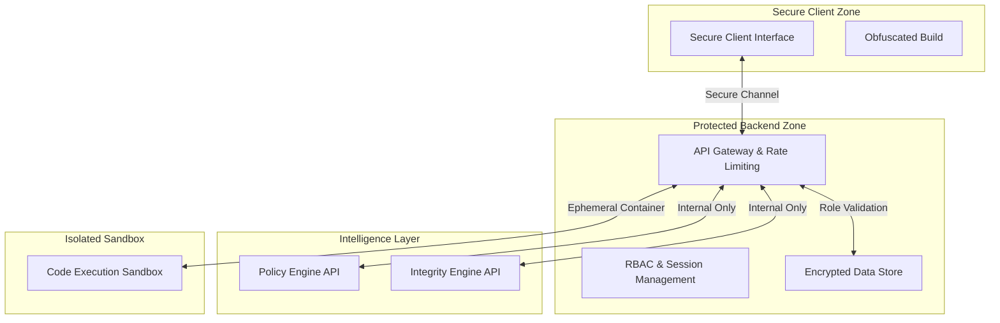

<div align="center">
  <br />
  
  <h1><b>NeuroX: Secure AI-Based Assessment System</b></h1>
  <h3><i>"Integrity Verification | Threat Prevention | Secure Evaluation"</i></h3>

  <p align="center">
    
    
    
  </p>


  <p align="center">
    <b>Engineered for High-Stakes Assessments & Digital Trust</b>
  </p>

  ---
</div>

## 🛡️ Overview

**NeuroX** is a secure, AI-driven online examination and assessment ecosystem designed to ensure **integrity, fairness, and trust** in digital evaluations. By leveraging proprietary **Behavioral Analysis Models** and a **Secure Runtime Environment**, NeuroX mitigates unauthorized access, insider threats, and academic dishonesty while delivering a seamless user experience.

> [!IMPORTANT]
> NeuroX redefines assessment security through a "Defense-in-Depth" approach, integrating **Identity Verification**, **Real-time Anomaly Detection**, and **Audit-ready Logging**.

---

## 🔐 Core Security Concepts & Mechanisms

NeuroX employs a multi-layered security architecture to protect the integrity of the assessment process.

### 1. Policy & Criteria Engine (`app_jd_parser.py`)
Formerly a job description parser, this module now functions as a **Policy Enforcement Engine**:
- **Requirement Mapping**: Translates assessment criteria into strict enforcement rules.
- **Complexity Calibration**: Automatically adjusts difficulty bands (`STANDARD`, `ELEVATED`, `RESTRICTED`) based on threat levels.
- **Weighted Risk Assessment**: Assigns integrity weights to different assessment modules.

### 2. Integrity Verification Mechanism (`app_skill_integrity.py`)
A binary classification model acting as an **Integrity Trust Engine**:
- **Behavioral Fingerprinting**: Monitors interaction patterns to detect anomalies.
- **Trust Validation Score**: Calculates a confidence score based on `behavioral_variance`, `response_latency`, and `consistency_checks`.
- **Insider Threat Detection**: Flags anomalies that suggest collusion or external assistance.

---

## 🚫 Intrusion Prevention & Anomaly Detection

We maintain a secure perimeter around the assessment environment using our **Active Threat Shield**.

### 🚨 Anomaly Response System
The system acts as an Intrusion Detection System (IDS) monitoring for:
1.  **Context Switching**: Detected via `violation_type: TAB_SWITCH`.
2.  **Environment Breaches**: Unauthorized window focus or external tool usage.
3.  **Anomalous Input**: Patterns resembling Copy-Paste injections or AI-generated text.

| Security Event | Severity | Automated Response |
| :--- | :--- | :--- |
| **Context Switch** | High | Session Alert & Logging |
| **Unauthorized Tool** | Critical | Session Termination & Lockout |
| **Prompt Injection** | Critical | Permanent Identity Block |
| **Plagiarism Pattern** | High | Flagged for Forensic Review |

---

## 🏗️ Secure Architecture

NeuroX follows a **Zero-Trust** architectural model, ensuring service isolation and data protection.



---

## 🛠️ Security & Tech Stack

| Component | Security Role | Technology |
| :--- | :--- | :--- |
| **Frontend** | Secure UI, Anti-Tamper | React 18, Tailwind CSS |
| **Backend** | Access Control, Audit Logs | Node.js, Express, Supabase |
| **Identity** | Authentication, RBAC | JWT, Redis (Session Store) |
| **AI Defense** | Behavioral Analysis | Python 3.10, Scikit-learn, Llama 3.3 |
| **Infrastructure** | Isolation, Containerization | Docker, Kubernetes (Proposed) |

---

## 📂 Documentation Modules

For detailed security breakdowns, please refer to our specialized documentation:

- [**Security Architecture & RBAC**](docs/SECURITY_ARCHITECTURE.md): Role-based access control and system design.
- [**Threat Model & Mitigation**](docs/THREAT_MODEL.md): Comprehensive analysis of threats and countermeasures.
- [**Compliance & Ethics**](docs/COMPLIANCE.md): Alignment with IT Acts and ethical AI guidelines.
- [**Syllabus Alignment**](docs/SYLLABUS_MAPPING.md): Mapping features to Cybersecurity learning outcomes.

---

## ⚙️ Secure Deployment

### 1. Hardened Installation
```bash
git clone https://github.com/your-repo/NeuroX.git
cd NeuroX
# Ensure strict permissions on configuration files
chmod 600 config/*.env
npm install-all
```

### 2. Environment Configuration
Configure `backend/.env` with strong secrets for `JWT_SECRET` and `DB_PASSWORD`.

### 3. Launch Secure Cluster
```bash
# Monitor logs for startup anomalies
npm run secure-start
```

---

<div align="center">
  <p><b>NeuroX</b>: Securing the Future of Digital Assessment.</p>
  <p>© 2026 <b>Team Cache Me If You Can</b>. Security & Integrity First.</p>
</div>
