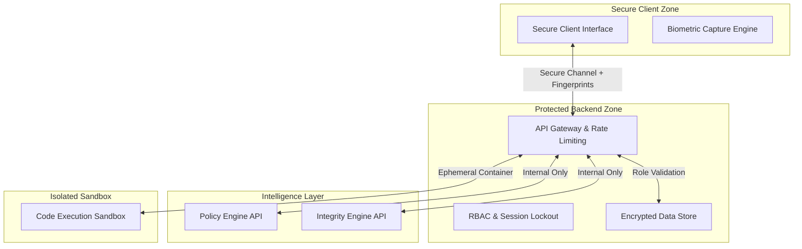

<div align="center">
  <br />
  
  <h1><b>NeuroX: Intelligence & Integrity Ecosystem</b></h1>
  <h3><i>"Defending the Digital Evaluation Frontier"</i></h3>

  <p align="center">
    
    
    
  </p>

  <p align="center">
    <b>Engineered for High-Stakes Assessments & Digital Trust</b>
  </p>

  ---
</div>

## 🛡️ Overview

**NeuroX** is a secure, AI-driven online examination and assessment ecosystem designed to ensure **integrity, fairness, and trust** in digital evaluations. By leveraging proprietary **Behavioral Analysis Models**, **Real-Time Anomaly Detection**, and a **Secure Runtime Environment**, NeuroX mitigates unauthorized access, insider threats, and academic dishonesty while delivering a seamless user experience.

> [!IMPORTANT]
> NeuroX redefines assessment security through a "Defense-in-Depth" approach, integrating **Device Fingerprinting**, **Behavioral Biometrics**, and **Audit-ready Forensic Logging**.

---

## 🔐 Core Security Concepts & Mechanisms

NeuroX employs a multi-layered security architecture to protect the integrity of the assessment process and the system as a whole.

### 1. Identity & Access Defense
- **Login Defense Mechanism**: Implements progressive account lockout (15-minute freeze after 5 failed attempts) to neutralize brute-force attacks.
- **Persistent Device Fingerprinting**: Captures granular hardware metrics (screen resolution, color depth, timezone, platform, CPU cores, memory) on every login to track and verify identity continuity.
- **Forensic Login Audit**: Maintains a rolling historical log of the last 10 origin IPs and user-agents for every entity in the system.

### 2. Behavioral Biometrics & Integrity Verification (`app_skill_integrity.py`)
A binary classification model acting as our **Integrity Trust Engine**, monitoring real-time human-computer interaction:
- **Keystroke Dynamics**: Tracks average keystroke latency to distinguish between human typing and automated injection.
- **Interaction Forensics**: Monitors backspace counts, answer change frequencies, and erratic mouse movements.
- **Trust Validation Score**: Calculates a dynamic confidence score ensuring the physiological patterns match natural human behavior.

### 3. Active Threat Shield (Anomaly Detection)
The system acts as a specialized Intrusion Detection System (IDS) during live assessments:
- **Clipboard Defeat**: Explicitly monitors and flags distinct `COPY_PASTE_ATTEMPT` events (Ctrl+C/V/X).
- **Hotkey Disablement**: Traps and logs `HOTKEY_BYPASS_ATTEMPT` events for dangerous key combinations (e.g., Ctrl+S, Ctrl+P, Alt+Tab).
- **Context Preservation**: Tracks window blur events (`TAB_SWITCH_OR_NOTIFICATION`) and exits from Fullscreen mode.
- **Time-based Anomalies**: Automatically flags `SUSPICIOUSLY_FAST_COMPLETION` if an exam is submitted with a high score in an impossibly short timeframe.

---

## 📊 Command Center & Forensic HUD

NeuroX separates concerns between active recruitment and deep security auditing via Role-Based Access Control (RBAC).

* **Admin Dashboard (SEC_ADMIN_L4)**: A dedicated forensic terminal providing a birds-eye view of all system identity logs. Features drill-down capabilities into specific user sessions, revealing their device fingerprint, behavioral biometrics payload, violation breakdowns, and real-time risk index.
* **Recruiter Command Center**: Allows HR personnel to provision jobs, generate AI-driven assessments, and review candidate talent profiles synced with their integrity health scores.
* **Candidate Mission Control**: A strict, locked-down testing environment restricted to authorized tasks.

---

## 🏗️ Secure Architecture

NeuroX follows a **Zero-Trust** architectural model, ensuring service isolation and data protection.



---

## 🛠️ Security & Tech Stack

| Component | Security Role | Technology |
| :--- | :--- | :--- |
| **Frontend** | Secure UI, Anti-Tamper, Biometrics | React 18, Tailwind CSS, Vite |
| **Backend** | Access Control, Audit Logs, Anomaly Engines | Node.js, Express, Supabase |
| **Identity** | Authentication, RBAC, Fingerprinting | JWT, PostgreSQL |
| **AI Defense** | Behavioral & Document Analysis | Python 3.10, Scikit-learn, Llama 3.3 |
| **Execution** | Code Isolation | Piston API Engine |

---

## ⚙️ Deployment & Execution

You can run the entire NeuroX cluster locally with a single command. 

### 1. Hardened Installation
```bash
git clone https://github.com/prathamsandesara/NeuroX.git
cd NeuroX
```

### 2. Launch Local Cluster
Run the master start script which concurrently boots the Python ML services, the Node.js Backend, and the React Frontend.
```bash
./run_all.sh
```

**Services Started:**
- Frontend: `http://localhost:5173`
- Backend: `http://localhost:4000`
- JD Parser ML: `http://localhost:5005`
- Integrity ML: `http://localhost:5001`

---

<div align="center">
  <p><b>NeuroX</b>: Securing the Future of Digital Assessment.</p>
  <p>© 2026. Security & Integrity First.</p>
</div>
