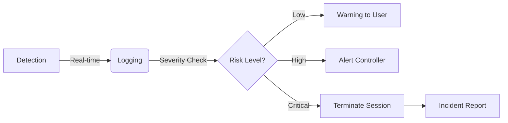

# Threat Modeling & Mitigation Strategies

## Overview
This document maps potential security threats to the specific defensive mechanisms implemented within the NeuroX platform. We employ a proactive **Threat-Mitigation Mapping** strategy to ensure assessment integrity.

## Threat-Mitigation Mapping

| Threat Category | Potential Attack Vector | NeuroX Mitigation Mechanism |
| :--- | :--- | :--- |
| **Unauthorized Access** | Credential Stuffing, Weak Auth | **RBAC & Secure Sessions**: Strict role enforcement and secure JWT handling. |
| **Insider Threat** | Collusion, Proctor Manipulation | **Audit Trails & Integrity Logs**: Immutable logging of all admin/controller actions. |
| **Assessment Fraud** | Impersonation, Proxy Testing | **Identity Verification**: Multi-factor checks (conceptual) and anomaly detection. |
| **Content Theft** | Screen Scraping, Question Leaks | **Environment Monitoring**: Detection of focus loss and unauthorized tools. |
| **Code Injection** | Malicious Code Submission | **Sandboxed Execution**: Ephemeral containers (`Piston`) with no network or filesystem access. |
| **AI Misuse** | LLM-generated answers | **Behavioral Analysis**: Detection of "copy-paste" velocities and non-human typing patterns. |
| **Availability** | DDoS / Resource Exhaustion | **Rate Limiting & Autoscaling**: Kubernetes-based scaling and API gateway limits. |

## Anomaly Detection System

NeuroX treats every assessment session as a continuous stream of behavioral data. Our **Anomaly Detection Engine** monitors for deviations from the norm.

### Detection Logic
The system tracks specific metrics to flag "Security Events":
1.  **Focus Events**: `blur` and `focus` events on the browser window. Frequent switching triggers a high-severity alert.
2.  **Input Velocity**: Typing speeds that exceed human capabilities (e.g., instant large blocks of text) flag potential copy-paste or script injection.
3.  **Time Variance**: Significant deviations in time-per-question compared to the global average for a difficulty band.

## Incident Response Flow

When a security event is detected, NeuroX follows a structured conceptual response flow:

1.  **Detect**: The event (e.g., Tab Switch) is captured by the client.
2.  **Log**: The event is securely logged to the backend with timestamp and context.
3.  **Alert**: If the risk threshold is crossed, the system triggers an alert to the Controller dashboard.
4.  **Review**: Post-assessment, admins can review the "Integrity Score" and detailed violation logs.

---
## Recent Architectural Updates & Security Hardening (v2.0)
The NeuroX platform has been recently upgraded with the following core features:
1. **Parallelized AI Evaluation Pipeline**: Re-engineered the backend to evaluate MCQs, Subjective answers, and Code execution concurrently using Promise.all with a strict 45-second fallback timeout, eliminating API gateway timeouts.
2. **Resilient Frontend Polling**: Upgraded the candidate Results dashboard with robust closure-safe 20-retry polling loops to fetch evaluation audit reports seamlessly once background processing finishes.
3. **Piston Rate-Limit Fallbacks**: Integrated robust error-handling for the Piston Code Execution Sandbox to automatically provide fallback evaluations if the public API hits 401 Unauthorized limits.
4. **Enhanced UI Contrast & Aesthetics**: Hardened Tailwind Dark-Mode heuristics across all candidate textareas to guarantee pitch-black backgrounds with bright text, maximizing readability during high-stress exams.
5. **Strict JSON Schema Parsing**: Overhauled the LLM assessment generation prompts and frontend regex parsers to prevent duplicate MCQ options from rendering and ensuring flawless data-structure formatting.
6. **Express Proxy Security**: Resolved high-severity 'trust proxy' validation crashes in Express Rate Limiting, securing the authentication endpoints against brute-force while stabilizing application boot sequences.
