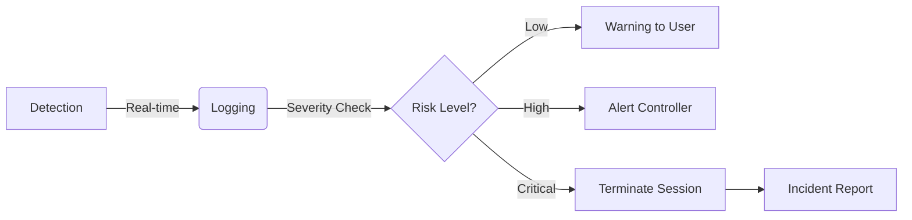

# Threat Modeling & Mitigation Strategies

## Overview
This document maps potential security threats to the specific defensive mechanisms implemented within the NeuroX platform. We employ a proactive **Threat-Mitigation Mapping** strategy to ensure assessment integrity.

## Threat-Mitigation Mapping

| Threat Category | Potential Attack Vector | NeuroX Mitigation Mechanism |
| :--- | :--- | :--- |
| **Unauthorized Access** | Credential Stuffing, Weak Auth | **RBAC & Secure Sessions**: Strict role enforcement and secure JWT handling. |
| **Insider Threat** | Collusion, Proctor Manipulation | **Audit Trails & Integrity Logs**: Immutable logging of all admin/controller actions. |
| **Assessment Fraud** | Impersonation, Proxy Testing | **Identity Verification**: Multi-factor checks (conceptual) and anomaly detection. |
| **Content Theft** | Screen Scraping, Question Leaks | **Environment Monitoring**: Detection of focus loss and unauthorized tools. |
| **Code Injection** | Malicious Code Submission | **Sandboxed Execution**: Ephemeral containers (`Piston`) with no network or filesystem access. |
| **AI Misuse** | LLM-generated answers | **Behavioral Analysis**: Detection of "copy-paste" velocities and non-human typing patterns. |
| **Availability** | DDoS / Resource Exhaustion | **Rate Limiting & Autoscaling**: Kubernetes-based scaling and API gateway limits. |

## Anomaly Detection System

NeuroX treats every assessment session as a continuous stream of behavioral data. Our **Anomaly Detection Engine** monitors for deviations from the norm.

### Detection Logic
The system tracks specific metrics to flag "Security Events":
1.  **Focus Events**: `blur` and `focus` events on the browser window. Frequent switching triggers a high-severity alert.
2.  **Input Velocity**: Typing speeds that exceed human capabilities (e.g., instant large blocks of text) flag potential copy-paste or script injection.
3.  **Time Variance**: Significant deviations in time-per-question compared to the global average for a difficulty band.

## Incident Response Flow

When a security event is detected, NeuroX follows a structured conceptual response flow:

1.  **Detect**: The event (e.g., Tab Switch) is captured by the client.
2.  **Log**: The event is securely logged to the backend with timestamp and context.
3.  **Alert**: If the risk threshold is crossed, the system triggers an alert to the Controller dashboard.
4.  **Review**: Post-assessment, admins can review the "Integrity Score" and detailed violation logs.
